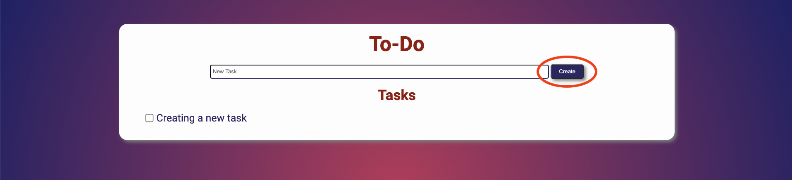
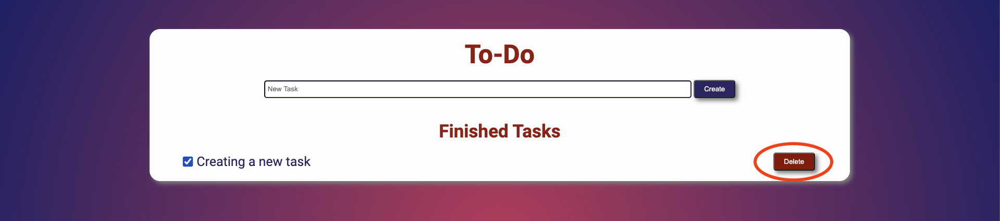

[![MIT License][license-shield]][license-url]
[![LinkedIn][linkedin-shield]][linkedin-url]

<!-- PROJECT LOGO -->
<br />
<p align="center">
  <a href="https://github.com/othneildrew/Best-README-Template">
    
  </a>

  <h3 align="center">A beautiful To-Do list</h3>

  <p align="center">
    Project created by <strong> guerracode </strong>
    <br />
    <a href="https://to-do-guerracode.herokuapp.com/"><strong>View Demo »</strong></a>
    <br />
    <br />
    ·
    <a href="https://github.com/guerracode/To-Do/issues">Report Bug</a>
    ·
    <a href="https://github.com/guerracode/To-Do/issues">Request Feature</a>
  </p>
</p>

<!-- TABLE OF CONTENTS -->

## Table of Contents

- [About the Project](#about-the-project)
  - [Built With](#built-with)
- [Getting Started](#getting-started)
  - [Prerequisites](#prerequisites)
  - [Installation](#installation)
- [Usage](#usage)
- [Contributing](#contributing)
- [Contact](#contact)

<!-- ABOUT THE PROJECT -->

## About The Project

[![Product Name Screen Shot][product-screenshot]](./static/images/start.png)

This is a personal project I've created to practice my skills with Node and Express.

### Built With

These are the main tools I've used to create this project.

- [Node](https://nodejs.org/en/)
- [Express](https://expressjs.com/)
- [EJS](https://ejs.co/)
- [express-session](https://www.npmjs.com/package/express-session)

All the tasks are stored in an Express session, so every time the user visits the page has all the tasks stored without login.

<!-- GETTING STARTED -->

## Getting Started

### Prerequisites

Use test this project locally, or visit our [web page](https://to-do-guerracode.herokuapp.com/).

- npm

```sh
npm install npm@latest -g
```

### Installation

1. Clone the repo

```sh
git clone https://github.com/your_username_/Project-Name.git
```

2. Install NPM packages

```sh
npm install
```

3. Run the project

```sh
npm start
```

<!-- USAGE EXAMPLES -->

## Usage

1. When starting locally or visiting the [web page](https://to-do-guerracode.herokuapp.com/) you will see a screen like this:
   

2. Enter a new Task in the input field and click **create**.
   

3. If you finish the task just check the checkbox and the task would move to finished tasks.
   

4. And click on the **delete** button to delete the task, is that easy!.

<!-- CONTACT -->

<!-- CONTRIBUTING -->

## Contributing

Contributions are what make the open source community such an amazing place to be learn, inspire, and create. Any contributions you make are **greatly appreciated**.

1. Fork the Project
2. Create your Feature Branch (`git checkout -b feature/AmazingFeature`)
3. Commit your Changes (`git commit -m 'Add some AmazingFeature'`)
4. Push to the Branch (`git push origin feature/AmazingFeature`)
5. Open a Pull Request

## Contact

Your Name - [@guerracode](https://twitter.com/guerracode) - josephsiul15@gmail.com

Project Link: [GitHub](https://github.com/guerracode/To-Do)

<!-- LINKS -->

[license-shield]: https://img.shields.io/github/license/othneildrew/Best-README-Template.svg?style=flat-square
[license-url]: https://github.com/guerracode/To-Do/blob/master/LICENSE
[linkedin-shield]: https://img.shields.io/badge/-LinkedIn-black.svg?style=flat-square&logo=linkedin&colorB=555
[linkedin-url]: https://www.linkedin.com/in/jose-luis-chavez/
[product-screenshot]: ./static/images/example.png
